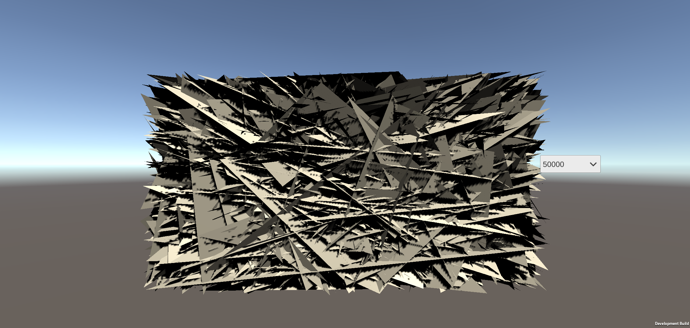

| 测试项             | 描述                                       | 关注硬件参数组                                  |
| ------------------ | ------------------------------------------ | ----------------------------------------------- |
| 纹理压缩格式       | ETC2（Crunched）、ASTC4/6/8、RGBA32、RGB24 | GPU Memory、Clocks、GPU Cache                   |
| 纹理FilterMode     | Point、Bilinear、Trilinear                 | GPU Memory、Clocks、GPU Cache、Texture Filtered |
| 纹理各向异性       | Aniso Level不同等级：4、8、12、16          | GPU Memory、Clocks、GPU Cache、Texture Filtered |
| 纹理的Mipmap       | 目前已知                                   | GPU Memory、Clocks、GPU Cache、Texture Filtered |
| Mesh复杂度         | Mesh顶点数：500、1000、5000、10000、50000  | GPU Memory、Clocks、GPU Cache                   |
| Blit Type          | 目前已知                                   | GPU Memory、Clocks、GPU Cache                   |
| URP Depth Texture  |                                            | GPU Memory、Clocks、GPU Cache                   |
| URP Opaque Texture |                                            | GPU Memory、Clocks、GPU Cache                   |
| Bloom              |                                            | GPU Memory、Clocks、GPU Cache                   |
| MSAA               |                                            | GPU Memory、Clocks、GPU Cache                   |

### URP

#### Depth/Opaque Texture

小米10，1080P，Copy全分辨率

| 多的DrawCall | Clocks  | Read   | Write  |
| ------------ | ------- | ------ | ------ |
| CopyColor    | 0.25M/s | 3.5M/s | 3.3M/s |
| CopyDepth    | 0.31M/s | 6.3M/s | 3.1M/s |

#### Bloom

1）默认参数Bloom25个DrawCall

2）1/4开始，22个DrawCall

3）1/4开始，限制4次下采样，10个DrawCall

帧数据如下表：

| Bloom描述                | DrawCall    | Read Total | Write total | Clocks |
| ------------------------ | ----------- | ---------- | ----------- | ------ |
| 默认，1/2开始，8次下采样 | 25，1+8*2+8 | 10.6MB     | 4.2MB       | 0.57M  |
| 1/4开始，7次下采样       | 22，1+7*2+7 | 5.6MB      | 0.9MB       | 0.43M  |
| 1/4开始，限制采样次数4次 | 10，1+4*3+4 | 5.5MB      | 0.9MB       | 0.26M  |

结论：

Bloom的带宽压力主要来源于前几个下采样及上采样，所以修改开始采样的分辨率对带宽影响比较大，限制采样次数对Clocks优化比较明显，所以这两方面的优化都比较重要，但相比较而言修改开始采样分辨率更优先（1/4开始，Bloom的R+W30帧就有约200MB/s）

#### MSAA

测试机型小米10，FPS30

分辨率0.85*1080P，Clocks曲线如下：

GPU Memory曲线如下：

分辨率1080P，Clocks曲线如下：

 GPU Memory曲线如下：

下表是MSAA不同Level各指标差值，括号中数据是0.85分辨率的

| MSAA Level DIFF | Clocks         | Read             | Write          |
| --------------- | -------------- | ---------------- | -------------- |
| 2-0             | 30M/s（25M/s） | 130M/s（75M/s）  | 8M/s（6M/s）   |
| 4-2             | 53M/s（35M/s） | 120M/s（120M/s） | 16M/s（12M/s） |
| 8-4             | ~0M/s（~0M/s） | ~0M/s（~0M/s）   | ~0M/s（~0M/s） |

结论：MSAA对Write的影响较小，但对Clocks和Read的影响还是比较大的（一般不建议使用），4x和8x表现差不多

#### FXAA&SMAA

小米10，分辨率1080P，FPS30，Clocks曲线如下：

 GPU Memory曲线如下：

下表是FXAA和SMAA（High）和None AA差值对比

| AA DIFF | Clocks | Read    | Write   |
| ------- | ------ | ------- | ------- |
| FXAA    | ~20M/s | ~200M/s | ~115M/s |
| SMAA    | ~60M/s | ~790M/s | ~315M/s |

结论：FXAA与SMAA对Read和Write影响都比较大，但Clocks影响相对较小
* * *
### FilterMode

采样纹理512x512，都开启Mipmap，压缩格式：ETC 4bit

帧数据如下表：

| FilterMode                | Read Total | Texture Read | Write total | Clocks | % L1 Miss | % L2 Miss |
| ------------------------ | ---------- | ----------- | ------ | ------------------------ | ------------------------ | ------------------------ |
| Point | 1MB     | 0.82MB | 3.65MB    | 0.35M | 4.4 | 11.0 |
| Bilinear | 1MB      | 0.82MB | 3.58MB    | 0.34M | 4.5 | 10.1 |
| Trilinear | 1MB        | 0.82MB | 3.58MB | 0.34M | 5.9 | 7.0 |

结论：纹理的Filter Mode对带宽及Clocks没有任何影响
* * *
### TextureFormat
FilterMode统一为Bilinear

帧数据如下表：

| TextureFormat                | Read Total | Write total | Clocks |
| ------------------------ | ---------- | ----------- | ------ |
| ETC2 | 0.97MB     | 1.05MB       | 0.29M  |
| ETC2(Crunch) | 0.97MB      | 1.03MB       | 0.3M  |
| ASTC4 | 0.96MB     | 1.05MB       | 0.29M  |
| ASTC6 | 0.68MB | 1.04MB | 0.31M |
| ASTC8 | 0.54MB | 1.03MB | 0.29M |
| RGBA32 | 2.77MB | 1.04MB | 0.29M |
| RGB24 | 2.75MB | 1.04MB | 0.31M |

结论：整体对于Clocks & Write没有太大影响，对于Read影响较大，压缩与不压缩Read比例大约为 1 ：3.5 ~ 4.5

* * *
### AnisotropicTexture
FilterMode统一为Bilinear，Format为ETC4

下表为5个阶段Clocks值

下表为5个阶段GPU Memory值

下表为5个阶段Texture Filtered值

帧数据如下表：
| Anisotropic | Read Total | Write total | Clocks |
| ------------------------ | ---------- | ----------- | ------ |
| Level0 | 4.77MB | 5.43MB | 0.51M |
| Level4 | 4.30MB | 5.16MB | 0.46M |
| Level8 | 4.27MB | 5.17MB | 0.46M |
| Level12 | 4.27MB | 5.17MB | 0.458M |
| Level16 | 4.26MB | 5.17MB | 0.468M |

结论：各向异性采样在小米10和小米9上对带宽及Clocks影响都不大

* * *
### Mesh Vertices

帧数据如下表：

| Vertices | Read Total | Write total | Clocks | Vertex Memory |
| ------------------------ | ---------- | ----------- | ------ | ----- |
| 500 | 3.07MB | 4.19MB | 0.4M | 11.81KB |
| 1000 | 3.78MB | 5.10MB | 0.46M | 23.5KB |
| 5000 | 8.27MB | 9.00MB | 0.74M | 117.56KB |
| 10000 | 11.59MB | 11.43MB | 0.93M | 234.87KB |
| 50000 | 26.60MB | 20.86MB | 2.0M | 1173.43KB |

结论：顶点数的增加对于Vertex Memroy Read基本呈线性关系

### Texture 2D Array vs Common

1）T2D Common

2）Texture 2D Array

| 测试Texture输入                  | Clocks | Read Total | Texture Read | Write  |
| -------------------------------- | ------ | ---------- | ------------ | ------ |
| Common Single Texture（Mipmap）  | 0.75M  | 1.17MB     | 0.73MB       | 0.96MB |
| Texture 2D Array（不开启Mipmap） | 0.63M  | 8.23MB     | 7.91MB       | 1.02MB |
| Texture 2D Array（开启Mipmap）   | 0.56M  | 0.9MB      | 0.63MB       | 0.98MB |

结论：

使用Texture2DArray的时候需要注意Mipmap是否开启，对带宽的影响较大

### Mipmap

生成了一张不同Mipmap颜色不同的纹理，然后在场景中各个Mipmap对应一个Quad

纹理的压缩格式为RBGA32，上面5个Quad是使用Mipmap的，下面5个Quad是没有开启Mipmap的Level0原图（512*512），帧渲染数据如下表

| MipMap level | Clocks | Read Total | Texture Read | Write   | % L1 Miss | %L2 Miss | %Stalled On SM |
| ------------ | ------ | ---------- | ------------ | ------- | --------- | -------- | -------------- |
| 0            | 101.9K | 218KB      | 184.9KB      | 315.1KB | 17.7      | 0        | 0              |
| 1            | 39.6K  | 58.2KB     | 42.4KB       | 49KB    | 18.3      | 0        | 0              |
| 2            | 24.1K  | 22.4KB     | 11KB         | 1.7KB   | 17.9      | 0        | 0              |
| 3            | 21.1K  | 12.3KB     | 2.5KB        | 1.3KB   | 17.4      | 0.2      | 0              |
| 4            | 18.9K  | 10.4KB     | 0.8KB        | 1.3KB   | 17.5      | 0.7      | 0              |
| Render Size  |        |            |              |         |           |          |                |
| 512          | 100.5K | 1152.5KB   | 1120.5KB     | 325.5KB | 21.3      | 46.8     | 0              |
| 256          | 42.4K  | 1086.5KB   | 1069KB       | 50.8KB  | 40.3      | 74.8     | 12.1           |
| 128          | 33.7K  | 1071.5KB   | 1056.6KB     | 1.7KB   | 65.4      | 124.5    | 22.6           |
| 64           | 24.5K  | 434.1KB    | 420.4KB      | 1.3KB   | 73.0      | 152      | 14.5           |
| 32           | 20.1K  | 124.8KB    | 111.8KB      | 1.3KB   | 69.3      | 164.3    | 3.8            |

结论：场景中除UI（非3D）及一些固定分辨率的纹理，一般都建议开启Mipmap，对带宽的影响是比较大的，同时对于Cache Miss的优化也是比较大的。

### UI

UIText测试，Canvas Scale With Screen Size：1920x1080，静态字体Font Size 25，如下图5个Text的组件TextSize设置依次为15、20、25、30、35

帧数据如下表

| Text Size | Clocks | Read Total | Texture Read | Write | % L1 Miss | % L2 Miss |
| --------- | ------ | ---------- | ------------ | ----- | --------- | --------- |
| 15        | 21K    | 10.2KB     | 4.2KB        | 1.5KB | 48.8      | 63        |
| 20        | 20.5K  | 9.7KB      | 4.3KB        | 1.4KB | 33.5      | 64.3      |
| 25        | 19.2K  | 10.3KB     | 4.7KB        | 1.4KB | 25.4      | 57.1      |
| 30        | 19.4K  | 10.8KB     | 5.4KB        | 1.4KB | 25.7      | 46.5      |
| 35        | 19.9K  | 11.6KB     | 5.8KB        | 1.4KB | 23.4      | 38.2      |

结论：

Text Size越小Cache Miss越高，但Clocks、Read Total、Write受Size影响比较小，Texture Read随着Size增大有略微增长趋势，但不是很明显，同时测试过程中遇到了采集帧数据会出现如下图所示的Bug，以后测试如果UI渲染中出现某个DrawCall数据异常，需要排查后面是否会出现数据统计为0的DrawCall

### Combine Texture vs Single Texture

结论：Combine和单图的Read是一样的，但Combine会导致Write增加，最终会影响下面的BlitCopy的Read（具体原因目前还没找到）建议使用单图。

